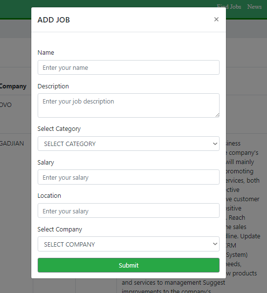
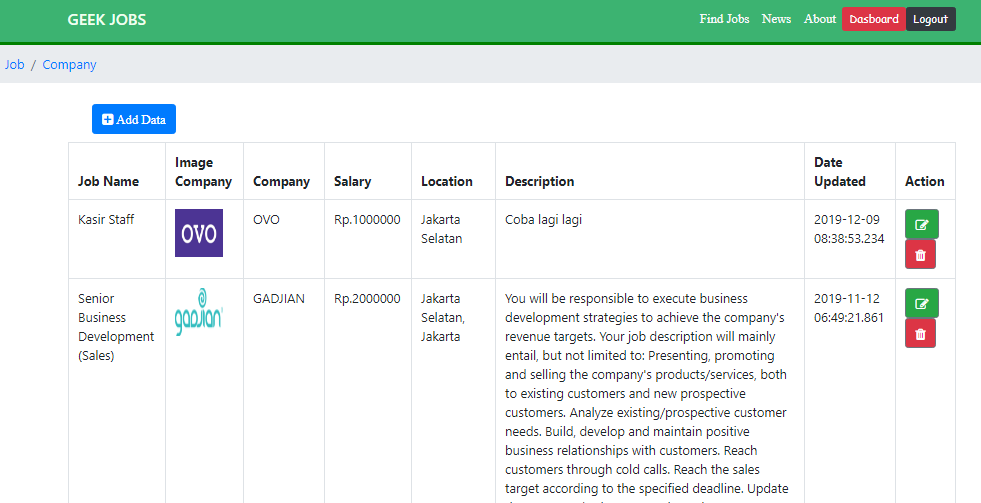
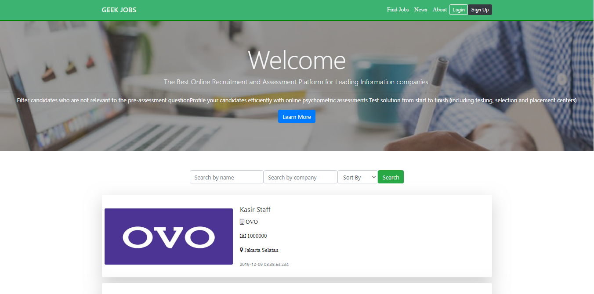
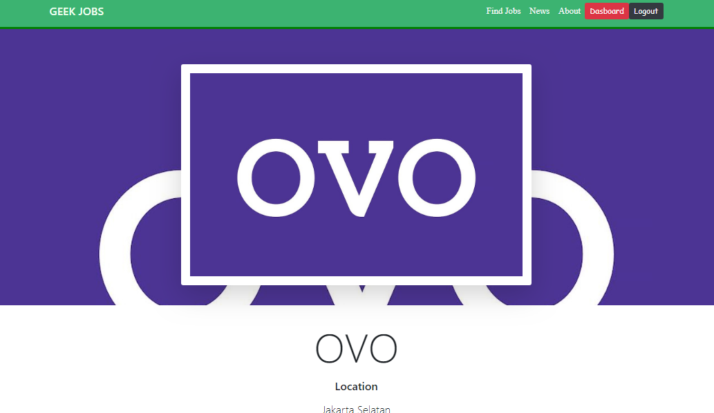
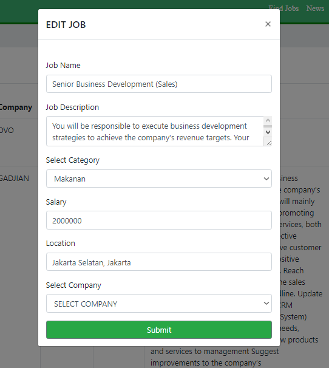
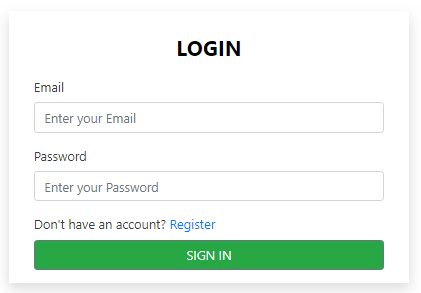

# GEEK JOBS : WEB JOB POSTING APP

> Job Posting App with ReactJS

<p align="center">
  <a href="https://reactjs.org/">
    
  </a>
</p>

---

## Prerequiste

- ReactJS
- Redux

## Definition

- [x] ReactJS: React is a JavaScript library for building user interfaces. Learn what React is all about on React's homepage. Click the image above.
- [x] Redux: Redux is a predictable state container for JavaScript apps. It helps you write applications that behave consistently, run in different environments (client, server, and native), and are easy to test. On top of that, it provides a great developer experience.

## Build Setup

1. Clone repository
   `$ git clone https://github.com/FakhrurR/react-job-posting.git`
  $ cd react-job-posting
2. Install depedencies

```bash
# with yarn
$ yarn install
```

3. Start React App

```bash
$ yarn start # start app
```

# Interface

 &nbsp;&nbsp;&nbsp;
 &nbsp;&nbsp;&nbsp;
 &nbsp;&nbsp;&nbsp;
 &nbsp;&nbsp;&nbsp;
 &nbsp;&nbsp;&nbsp;
 


## License and Support

For Bug report, please contact me
[FakhrurR](https://github.com/FakhrurR 'FakhrurR')

MIT

Copyright © 2019 by Fakhrur Rijal